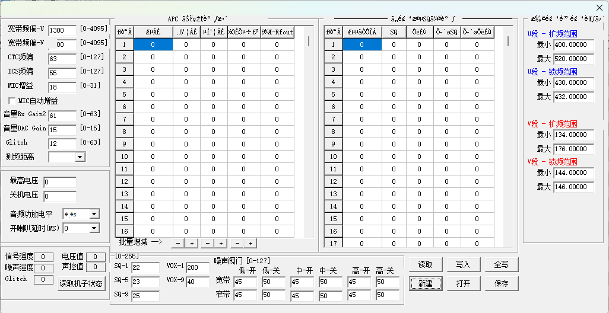
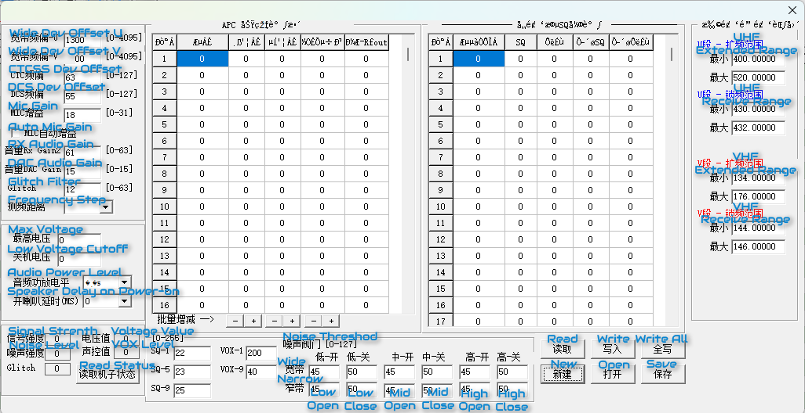
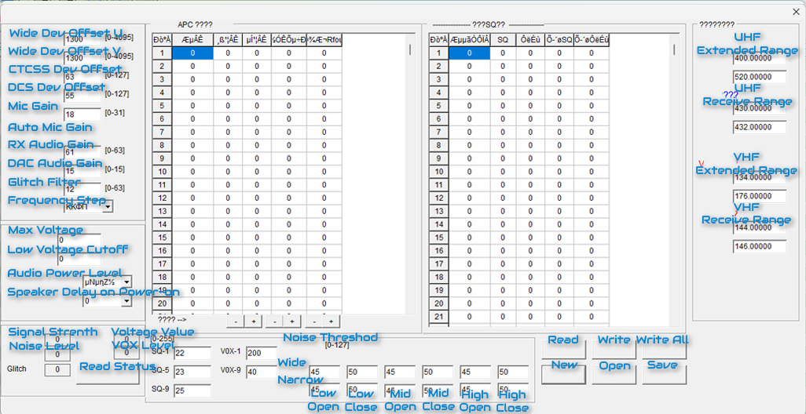
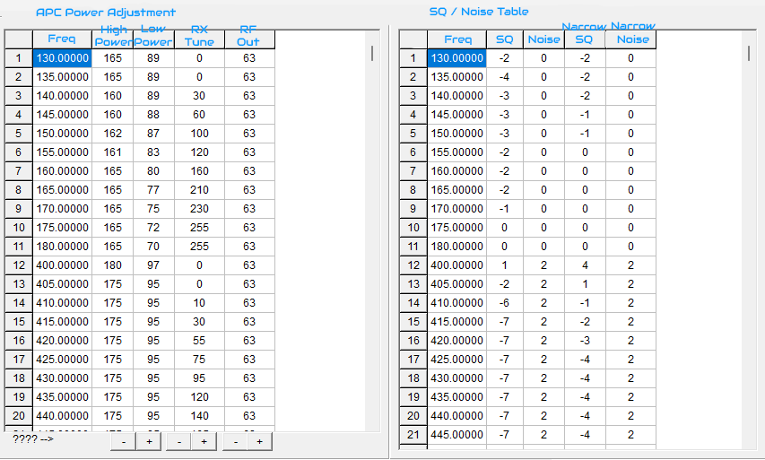

# Hiroyasu IC-980Pro Max CPS (8110) Adjustment Menu – Translation & Function Reference

  
  
  

---

## ⚠️ WARNING – READ BEFORE PROCEEDING

These settings are **factory calibration parameters**.

> Incorrect values may result in:
> - No transmission
> - Distorted audio
> - Receiver malfunction
> - Out-of-spec RF behavior
> - MAGIC SMOKE!

### ALWAYS:
1. Click **Read** from the radio  
2. Save the configuration file  

This is your only reliable recovery method.

---

## What is this

This project documents and explains the internal calibration parameters  
of the Hiroyasu IC-980Pro Max from the CPS.

These parameters are normally hidden and undocumented, and are used for:

- RF calibration (TX power, deviation)
- Receiver tuning
- Squelch behavior
- Audio processing

⚠️ This is **not a beginner menu**.

---

## How the CPS Calibration Works

The CPS uses **lookup tables (LUTs)**.

- Each row defines behavior for a frequency range  
- The radio interpolates values between frequency points  

This affects:

- TX power output (⚠️)  
- Receiver sensitivity  
- Squelch behavior  

---

## RF / Audio Parameters

| Chinese | English | Function |
|--------|--------|----------|
| 宽带频偏-U | Wideband Deviation Offset (UHF) | Sets FM deviation level for UHF in wide mode |
| 宽带频偏-V | Wideband Deviation Offset (VHF) | Sets FM deviation level for VHF in wide mode |
| CTC频偏 | CTCSS Deviation Offset | Adjusts deviation of CTCSS tone |
| DCS频偏 | DCS Deviation Offset | Adjusts deviation of DCS signaling |
| MIC增益 | Mic Gain | Controls microphone input level (TX modulation) |
| MIC自动增益 | Mic AGC | Automatic microphone gain control |
| 音量Rx Gain2 | RX Audio Gain | Controls received audio amplification |
| 音量DAC Gain | AF DAC Gain | Controls audio output level (speaker/AF out) |
| Glitch | Glitch Filter | Filters short noise spikes/interference |
| 测频距离 | Frequency Step | Frequency measurement/scan step resolution |

---

## Voltage & Audio

| Chinese | English | Function |
|--------|--------|----------|
| 最高电压 | Max Voltage | Maximum operating voltage |
| 关机电压 | Low Voltage Cutoff | Voltage threshold for automatic shutdown |
| 音频功放电平 | AF Power Level | Audio amplifier output level |
| 开机喇叭延时(ms) | Power-on Speaker Delay (ms) | Delay before speaker activates on startup |

---

## Monitoring / Live Values

| Chinese | English | Function |
|--------|--------|----------|
| 信号强度 | Signal Strength | Received signal strength (RSSI) |
| 噪声强度 | Noise Level | Background noise level |
| 电压值 | Voltage Value | Current supply voltage |
| 声控值 | VOX Level | VOX activation threshold |
| 读取机子状态 | Read Radio Status | Reads real-time radio status |

---

## Squelch / Noise Threshold

| Chinese | English | Function |
|--------|--------|----------|
| 噪声阈门 | Noise Threshold Level | Defines squelch opening threshold |
| 低-开 | Low Open | Squelch open threshold (low level) |
| 低-关 | Low Close | Squelch close threshold (low level) |
| 中-开 | Mid Open | Squelch open threshold (mid level) |
| 中-关 | Mid Close | Squelch close threshold (mid level) |
| 高-开 | High Open | Squelch open threshold (high level) |
| 高-关 | High Close | Squelch close threshold (high level) |
| 宽带 | Wide | Applies to wideband FM |
| 窄带 | Narrow | Applies to narrowband FM |

---

## Band Ranges

| Chinese | English | Function |
|--------|--------|----------|
| U段-扩频范围 | UHF Frequency Range (Extended) | Defines extended operating range (may enable out-of-band TX/RX) |
| U段-收频范围 | UHF Receive Range | Defines receive frequency range |
| V段-扩频范围 | VHF Frequency Range (Extended) | Defines extended operating range (may enable out-of-band TX/RX) |
| V段-收频范围 | VHF Receive Range | Defines receive frequency range |
| 最小 | Min | Minimum frequency |
| 最大 | Max | Maximum frequency |

---

  

---

## APC Power Adjustment Table

| Column | Meaning | Description |
|--------|--------|-------------|
| Freq | Frequency (MHz) | Reference frequency point for calibration |
| High Power | TX High Power Level | Output power setting in high power mode |
| Low Power | TX Low Power Level | Output power setting in low power mode |
| RX Tune | RX Gain Calibration | Receiver calibration (affects sensitivity and alignment) |
| RF Out | RF Drive Level | RF drive level from chipset (controls PA drive) |

### Behavior

- Defines TX power curve across frequency  
- Controls PA drive and output linearity  
- Also affects receiver calibration  

⚠️ Incorrect values may:
- Overdrive the PA  
- Reduce output power  
- Cause distortion or spurious emissions
- Magic Smoke!  

---

## SQ / Noise Table

| Column | Meaning | Description |
|--------|--------|-------------|
| Freq | Frequency (MHz) | Frequency threshold (applies up to this frequency) |
| SQ | Squelch Level | Base squelch threshold |
| Noise | Noise Level | Reference noise floor |
| Narrow SQ | Narrowband Squelch | Squelch threshold in narrow mode |
| Narrow Noise | Narrowband Noise | Noise reference in narrow mode |

### Behavior

- Defines squelch thresholds per frequency range  
- Uses hysteresis (open vs close behavior)  
- Separate handling for wideband and narrowband  

⚠️ Incorrect values may:
- Cause constant squelch opening  
- Block weak signals  
- Create unstable squelch  

---

## Internal Signal Path (Simplified)

Mic → ADC → DSP → Deviation → RF Drive → PA → Antenna

- Mic Gain → affects ADC input  
- Deviation Offset → affects modulation width  
- RF Drive → affects PA output power  
- RX Tune → affects receiver sensitivity  

---

## Buttons

| Chinese | English | Function |
|--------|--------|----------|
| 读取 | Read | Read settings from radio |
| 写入 | Write | Write settings to radio |
| 全写 | Write All | Write all parameters to radio |
| 新建 | New | Create new configuration |
| 打开 | Open | Open configuration file |
| 保存 | Save | Save configuration file |

---

## Adjustment Menu Passwords

- ww01 → General settings  
- wwuser  
- wwpd  
- wwband → Expand RX/TX frequency limits  
- wwjxs  
- updated  
- logo → Change startup logo (16-bit bitmap required)

---

## Tool for Memory Management

You can use the Python script provided [here](https://github.com/vegos/Hiroyasu_IC-980Pro_Max/tree/main/Import-Export_Script).

- Export to CSV  
- Import channel memories  
- Edit and clone configurations easily  

---

## Author

Antonis Maglaras — ©2026
